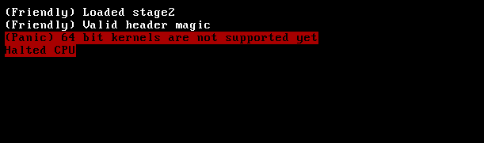

# Friendly bootloader

`Friendly` is an experimental bootloader written entirely in x86 assembly, it is meant to boot kernel's given it's elf file.

How would it boot: (Note: This hasn't been implemented yet, it's a just gameplan)
- Move the kernel elf to `boot/friendly-exec/kernel.elf`, the rest is a matter of executing `make` and `make run`

### Goals:    
- Support a popular (stivale, multiboot, ...) or custom boot protocol
    
- Load and execute a kernel's elf file
    
- Support 32 bit kernels only

### Screenshots:
- An attempt to load a 64 bit kernel
